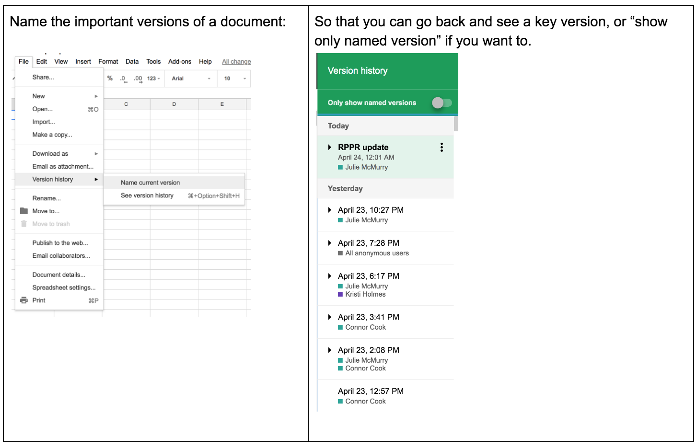
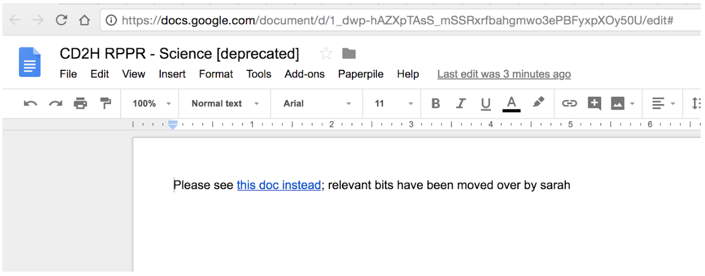
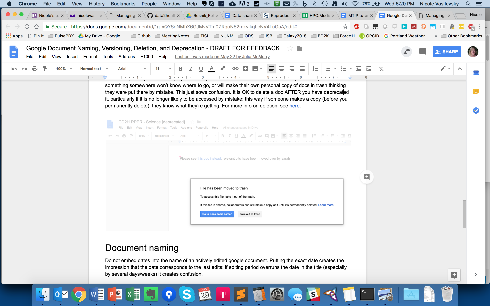

## Lesson 3: Survival strategies for managing  documents in shared locations 
##### [Back to Home](../index.md)

### Overview:

The old chestnet: "You can please some of the people all of the time, and all of the people some of the time, but not all of the people all of the time."

- [Deciding when GitHub is the right choice for your project](#when-to-use-github)  
- [Google Document Naming, Versioning, Deletion, and Deprecation](#google-document-naming-versioning-deletion-and-deprecation)

### When to use GitHub

It can be tricky to figure out what technologies to use for what kinds of purposes. The table below is a simplified matrix comparing different systems for collaboratively working on documents and versions.

Legend:
````
+++ Purpose-built
++ Reasonably suited
+ Barely suited
- not supported
--- Disastrous implications when attempted
````

Note:
Native Google Docs is not the same as Google Drive. These are often conflated.

#### When to use GitHub for managing versions your (text or data) documents

| Feature | GitHub        | Native Google Docs | Office via DropBox  | Office via Box  | Office via Google Drive  |
|:-------:|:-------------:|:------------------:|:--------------------:|:--------------------:|:--------------------:|
|Concurrent collaborative editing	| + `#`	| +++| +++ (office online only) | +++ (office online only) | ?|
|Serial collaborative editing	| +++	| +++	| +++	| + `#` |+ `#`|
|Typesetting and formatting `*`	| ++	| ++	| +++	| +++|
|Version control	| +++	| ++	| +	| + |
|View either clean or marked up versions without necessarily accepting changes	| +++	| -	| +++	| +++| +++|
|Compare any two versions | 	+++	| -| 	+| 	+| + |
|Public attribution of specific contributors| 	+++	| -	| -| 	-|-|
|R/W access control at team level| 	+++| 	+| 	+| 	+|+|
|R/W access control at individual level	| -	| +++	| +++	| +++|+++|
|OHSU approved for sensitive data/communications (PHI/PII) | - | - | - | +++ | -|

`#` True serial collaborative editing is supported via Box, however at this time, Box does not warn users regarding who already has a document open. Consequently, using Box in the context of tight deadlines with multiple contributors requires extremely rigorous immediate communication regarding who has the lock on a document at any given moment. In our team's experience collaboratively writing grant proposals under tight deadlines, the lack of safeguards afforded by automatic notification (eg as supported by DropBox, by contrast) have led to confusion and lost effort in our experience. GitHub does not support simultaneous collaborative editing, however if editing happens to be carried out simultaneously by chance, conflicts are easy to assess and resolve.

`*` Note that the formatting afforded by markdown is sleek but bare bones (affords more focus on content and less on rendering as  text can be rendered differently in different contexts (desktop, mobile, etc). Thus, more about structure (headings) and emphasis and less about style (color of text). 

While editing in "Office 365" mode can theoretically overcome some these hurdles, it is not free and not widespread. Moreover, it should not be conflated with "Office online" which supports only serial collaborative edits with document locks. Implications for tight deadlines are poor.

Combinations of technologies can work synergistically (eg. link a google doc to a github issue) if you understand their strengths and limitations.

Box is the only OHSU-approved system for the storage of PHI/PII; all questions related to what constitutes PHI/PII must be referred to the appropriate OHSU office.

#### When to use GitHub for your tracking and managing your projects

| Feature | GitHub issues       | [MS Project](https://products.office.com/en-us/project/compare-microsoft-project-management-software) | [JIRA](https://www.atlassian.com/software/jira)  | [Trello](http://trello.com) |
|:-------:|:-------------:|:------------------:|:--------------------:|:--------------------:|
|Free	| +++	| -- | ---| +++ |
|Transparent/attribution-friendly	| +++	| +	| ---	| + |
|Suited to digital-artifact based projects `**`	| +++	| +++	| - | ++ |
|Tight integration w GitHub	| +++	| +	| + | + |
|Tight integration w chat systems	| +++	| ?	| ? | ? |
|Detailed dependency view/control| + | +++ |+++| ? |
|Powerful but not overwhelming/feature-bloated |+++| + | -- | +++ |

TL;DR this is Julie's personal opinion: MS Project and JIRA are best reserved for gigantic multidependency projects that ALSO have a project management blackbelt at the helm AND that have the buy-in of the team for a lot of organizational overhead. For *most* projects in academia, I have found GitHub, in combination with Google Docs, to be ample tool for the PM job. Managing well has less to do with tools and more to do with discipline/organizational culture. Other PM tools exist that are GitHub integrated, such as ZenHub and Waffle.io. Our advice would be to first get really comfortable with the native basics in GitHub and workarounds (eg. specialized use of labels) and then explore the options for your use case.

`**` GitHub is not per se *poorly* suited to managing projects that are not digital artifact based, but there's less of a marginal advantage that makes it a clear win over other free tools like Trello. The caveat is that when all of someone's projects, regardless of nature, are on GitHub, their competing priorities are easier to spot and tackle.

### Google Document Naming, Versioning, Deletion, and Deprecation 

The whole beauty of google documents is the ability to have a living collaboratively-edited document that is version controlled by default.

#### Creation
Wherever possible when creating a Google doc, it is best to do so natively rather than via upload (see below). If you upload a native MS Office document, when people click on it and open in drive, they create a copy which then creates confusion about what the source of truth is.


#### Versioning

For things like weekly meeting minutes, a single document with running minutes is far better than a different document per meeting each week.



#### Deletion and deprecation

Stay in the same document unless there’s a reason you can’t (for instance a tab needs to move from one sheet to another, or if two parallel docs have been merged):
1. Do not delete the old one [at least not in short term]
2. If a document (not a tab in a spreadsheet) Rename the old document with the date and “deprecated” or some other indicator
3. If you leave content in there, set the permissions for the old document or tab to “view only”. Otherwise you may wish to delete contents.
4. Put a link to the NEW document from the old one

Something like this:


Do not keep multiple versions lying around in parallel with no links between them. People that expect to find something somewhere won’t know where to go, or will make their own personal copy of docs in trash thinking they were put there by mistake. This just sows confusion. It is OK to delete a doc AFTER you have deprecated it, particularly if it is no longer likely to be accessed by mistake; this way if someone makes a copy (before you permanently delete), they know what they’re getting. For more info on deletion, see here.



#### Document naming

Do not embed dates into the name of an actively edited google document. Putting the exact date creates the impression that the date corresponds to the last edits: if editing period overruns the date in the title (especially by several days/weeks) it creates confusion. 

Having a future date in there is ok such as “Report XXX due 2019-04-27” or a “Board presentation for 2020-19-27”. However, embedding past dates such as “Report Aim 1 2017-12” cause confusion as they signal to others that the version is stale and either a) overtaken by another version (somewhere else) or b) no longer to be edited for some reason.

Living actively-edited documents can be named with the year or month if useful to convey freshness, else it can be omitted. Version history is always there if someone needs to inspect.

For naming of STATIC files such as Microsoft Office (word, excel etc) (non native google documents); version control is a bit of a mess.

#### Filing (any) document

No matter where you file your docs, think carefully about:
 - Which folder x team permissions make the most sense for your project
 - Guidance about which kinds of documents go in which places

Disk space is cheap; document search is cheap. Beyond these high level considerations, don't hand wring over baroque folder structure: Filing a document in *some* shared location with a searchable title is far more important than filing it in exactly the right subfolder. Don't postpone filing because you're overthinking subfolders.

Have a huge backlog of unfiled documents? Create an "attic": a folder whose contents are of unknown / archival value. Gradually move things out as needed.

To "Marie Kondo" your documents/email by dumping things in archive is a lot easier than individually handling each document.

To preserve the single source of truth, instead of sending docs as an email attachment, where possible, link to the document whether in box, dropbox, drive, etc.

The entire point of filing a document is to be able to retrieve it.

##### Tasks
- Do a search on your hard drive for files called generic things like 'budget' or 'report'. Can you tell at a glance if they're what you're looking for without examining the path of each?
- Improve the filename and try the search again. Did it help?
- Experiment with sharing a file using a link instead of an attachment
- Customize your browser toolbar with links to frequently accessed documents
- Explore the document version history available in your platform of choice. Identify a prior version and restore it.
  - Box.com
  - Dropbox
  - GDrive

##### [Click here for Lesson 4](https://data2health.github.io/mtip-tutorial/lessons/Lesson4.html) 
### [Back to Home](../index)
